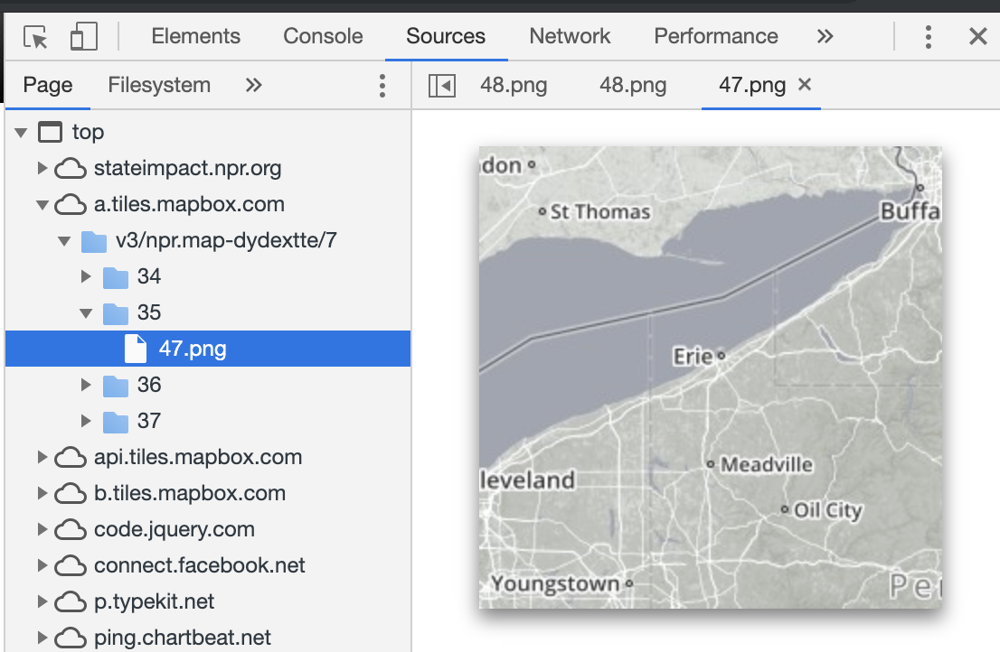

# GEOG 585 - Open Web Mapping
__https://www.e-education.psu.edu/geog585/node/519__

- Prereqs: some programming experience, some JS experience, some HTML and CSS experience
- Video intro/overview of course: https://gis.e-education.psu.edu/node/410  

## 1. FOSS and its use in web mapping
__https://www.e-education.psu.edu/geog585/node/3__

### Notes:
- Interesting overview of the progression from physical maps to digital maps on local file systems to maps hosted for public use (but clunky) to web 2.0 (maps for public use with smooth interfaces) to ubiquitous mobile maps
- Open source solutions can be a big plus for governments, mostly for reasons of transparent security and low cost, but also at times for wanting to reject US corporations (see Brazil's policy http://aaronshaw.org/papers/Shaw-2011-Insurgent_Expertise-JITP.pdf)
- Esri's Geodatabase is a closed source specification
- Being aware of use limitations to software and data is important (can products that use these be sold?... depends on the license)
- QGIS: Download and install python 3.6 from main python distro prior to installing QGIS


### Assignment
1. Which of [Ramsey's observations](https://www.youtube.com/watch?v=jUgiG6eaYtI) about FOSS and proprietary software have you observed in your own home or workplace (does not have to be GIS related)? Or, if you don't think Ramsey's observations are legitimate, justify why.  
- __The prohibitive cost of scaling when expensive licenses are needed__  
- __Appeal of working with open source tech as an attractor of talent__
2. After studying this lesson, would you advocate the use of a pure FOSS approach for your GIS work, or are there certain elements of proprietary software that you would retain as part of a hybrid approach? If the latter, which software would you want to keep as proprietary?  
__I would advocate for using only FOSS GIS tools unless serving a client who is using closed source tools and requires tight integration__

### Additional Resources:  
- https://docs.qgis.org/3.4/en/docs/user_manual/
- https://docs.qgis.org/testing/en/docs/pyqgis_developer_cookbook/

## 2. Designing web services and web maps
__https://www.e-education.psu.edu/geog585/node/683__

### Notes:
- Obvious but good to remember... HTTP and/or WebSockets are how things are passed between server and client in maps just like in any other web app.
- Tiled vs. dynamically drawn? Most instances are easy to pick (basemaps and interactive elements being the two extreams) but sometimes the tradeoffs can be subtle
- GeoServer set up was pretty easy and straight forward. I installed an older version because installing without the install package was harder than just using the dmg

### Assignment (Analyze web map)
- The web address (URL) of the map and who created it.  
  - http://stateimpact.npr.org/pennsylvania/drilling/
  - NPR/State Impact Pennsylvania (Chris Amico, Danny DeBelius, Scott Detrow and Matt Stiles)

- The basemap, thematic layers, and interactive elements in the map.
  -  Basemap: Grayscale map of US with roads in white
  -  Thematic Layers: Natural gas drilling locations in PA
  -  Interactive Elements: Each drilling location is clickable and shows metadata about the site (Name, Operated By, etc.)  

- The servers and display techniques used for each layer (tiles, image drawn by the server on the fly, browser-drawn vector graphics, etc.). Use your web browser's developer tools/plugins to figure this out. For example, using Firebug while you pan around the map, you might determine that your web map is pulling in a tiled basemap from CloudMade.com. This is enough for the assignment; you don't have to go into further technical details about how the tiles were made or their file structure.
  - The basemap is served as tiles from mapbox:
  - 

- The software and programming framework used to build the web map (if you can determine this) and whether it is proprietary or FOSS.
  - Leaflet which is FOSS  

- Suggestions on how the map administrator could make this map more useful or faster performing.
  - Performance: The performance was pretty good on laptop. Took ~8 seconds to load when throttled to mid-teir mobile with Chrome dev tools but the rest of the site loaded fairly quickly.
  - Usefulness: The drilling sites become hard to see when zoomed in... The sites marker size should increase a bit as a user zooms in.

### Additional Resources:  
- Go to HTTP reference: https://www.tutorialspoint.com/http/index.htm
- GeoServer vs mapServer: https://anitagraser.com/2010/06/08/geoserver-vs-mapserver/


## 3.Storing and processing spatial data with FOSS
__https://www.e-education.psu.edu/geog585/node/689__

### Notes:
- GeoJSON Types: point, lineString, Polygon, Collection (multiPoint, multiLineString, multiPolygon)
- TopoJson: geoJSON but saves space by not repeating shared borders
- GDAL - Raster utilities
- OGR - Vector utilities
- Great utility for converting between formats: https://gdal.org/programs/ogr2ogr.html
- Finding what coordinate system data is in:
  - Can add to a new QGIS file and see in bottom right
  - Shapefiles also have a `.prj` file with some of this info

TODO: get ogr2ogr working from the command line... getting the following error:
```
dyld: Library not loaded: @rpath/libgif.7.dylib
  Referenced from: /anaconda3/lib/libgdal.20.dylib
  Reason: image not found
Abort trap: 6
```

## 4 - 5 (skipping for now)

## 6. Putting layers together with a web mapping API

### Notes:
- Mapbox extension of Leaflet is what I'll be mostly using. Some example docs from Kyle:
  - https://docs.mapbox.com/mapbox.js/api/v3.2.0/?utm_medium=sem&utm_source=google&utm_campaign=sem%7Cgoogle%7Cbrand%7Cchko-googlesearch-pr01-dynamicsearchcampaign-nb.broad-all-landingpage-search&utm_term=brand&utm_content=chko-googlesearch-pr01-dynamicsearchcampaign-nb.broad-all-landingpage-search&gclid=Cj0KCQjw3uboBRDCARIsAO2XcYDHP1OEc2eIT1Cw_vb02MdDd7ZALcuDpqhzITTJxYsSbNxJxvXylX0aAl3SEALw_wcB
  - https://docs.mapbox.com/mapbox-gl-js/api/
- 